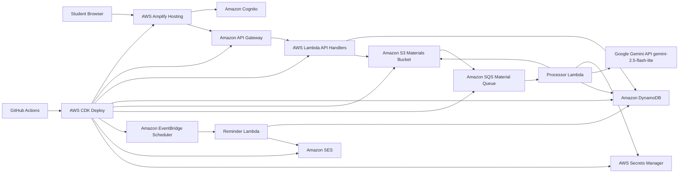

# AI Study Planner Implementation Plan

> **For agentic workers:** REQUIRED SUB-SKILL: Use superpowers:subagent-driven-development (recommended) or superpowers:executing-plans to implement this plan task-by-task. Steps use checkbox (`- [ ]`) syntax for tracking.

**Goal:** Build the approved AI Study Planner MVP: AWS serverless app with React frontend, Cognito auth, API Gateway/Lambda backend, DynamoDB data, S3/SQS material processing, Gemini 2.5 Flash-Lite AI, EventBridge/SES reminders, and CDK/GitHub Actions deployment.

**Architecture:** The app is a TypeScript monorepo with separate `apps/web`, `apps/api`, `infra`, and `packages/shared` workspaces. Runtime infrastructure is AWS-first serverless, while generative AI is provided by Google Gemini API through backend Lambda only. Async document processing uses S3 events routed to SQS and consumed by a Processor Lambda.

**Tech Stack:** TypeScript, React, Vite, AWS CDK, AWS Lambda, API Gateway, DynamoDB, S3, SQS, Cognito, EventBridge Scheduler, SES, Secrets Manager, Vitest, React Testing Library, GitHub Actions, Google Gemini API.

---

## File Structure

- `package.json`: npm workspace root scripts.
- `tsconfig.json`: root TypeScript solution config for build mode references.
- `tsconfig.base.json`: shared TypeScript compiler settings.
- `vitest.config.ts`: shared test configuration for backend/shared packages.
- `packages/shared/src/types.ts`: shared domain types.
- `packages/shared/src/validation.ts`: request validation helpers.
- `apps/api/src/http/*`: API Gateway Lambda handlers.
- `apps/api/src/services/*`: domain services for DynamoDB, S3, Gemini, reminders.
- `apps/api/src/async/processMaterial.ts`: SQS material processor Lambda.
- `apps/api/src/async/sendReminders.ts`: scheduled reminder Lambda.
- `apps/api/test/*`: backend unit tests with mocked AWS/Gemini clients.
- `apps/web/src/*`: React frontend.
- `infra/lib/ai-study-planner-stack.ts`: CDK stack.
- `.github/workflows/ci.yml`: build/test/synth workflow.
- `docs/architecture/ai-study-planner.mmd`: Mermaid architecture diagram.

## Task 1: Initialize TypeScript Monorepo

**Files:**
- Create: `package.json`
- Create: `tsconfig.json`
- Create: `tsconfig.base.json`
- Create: `vitest.config.ts`
- Create: `.gitignore`

- [ ] **Step 1: Create root package configuration**

```json
{
  "name": "ai-study-planner",
  "private": true,
  "workspaces": [
    "apps/*",
    "packages/*",
    "infra"
  ],
  "scripts": {
    "build": "npm run build --workspaces --if-present",
    "test": "vitest run",
    "typecheck": "tsc -b",
    "lint": "npm run lint --workspaces --if-present",
    "cdk:synth": "npm --workspace infra run synth"
  },
  "devDependencies": {
    "@types/node": "^24.0.0",
    "typescript": "^5.9.0",
    "vitest": "^3.2.0"
  }
}
```

- [ ] **Step 2: Create root TypeScript solution config**

```json
{
  "include": [],
  "references": []
}
```

- [ ] **Step 3: Create shared TypeScript settings**

```json
{
  "compilerOptions": {
    "target": "ES2022",
    "module": "ESNext",
    "moduleResolution": "Bundler",
    "strict": true,
    "esModuleInterop": true,
    "skipLibCheck": true,
    "forceConsistentCasingInFileNames": true,
    "resolveJsonModule": true,
    "baseUrl": ".",
    "paths": {
      "@shared/*": ["packages/shared/src/*"]
    }
  }
}
```

- [ ] **Step 4: Create Vitest config**

```ts
import { defineConfig } from "vitest/config";

export default defineConfig({
  test: {
    globals: true,
    environment: "node",
    include: ["apps/api/test/**/*.test.ts", "packages/shared/test/**/*.test.ts"]
  }
});
```

- [ ] **Step 5: Create `.gitignore`**

```gitignore
node_modules/
dist/
coverage/
.env
.env.*
cdk.out/
.superpowers/
```

- [ ] **Step 6: Install dependencies and verify**

Run: `npm install`

Expected: dependencies install and `package-lock.json` is created.

- [ ] **Step 7: Initialize git if needed**

Run: `git rev-parse --is-inside-work-tree`

Expected if not a repo: command fails. Then run:

```bash
git init
git add package.json package-lock.json tsconfig.json tsconfig.base.json vitest.config.ts .gitignore
git commit -m "chore: initialize monorepo"
```

Expected: initial commit is created.

## Task 2: Shared Domain Types And Validation

**Files:**
- Create: `packages/shared/package.json`
- Create: `packages/shared/tsconfig.json`
- Create: `packages/shared/src/types.ts`
- Create: `packages/shared/src/validation.ts`
- Create: `packages/shared/test/validation.test.ts`

- [ ] **Step 1: Write validation tests**

```ts
import { describe, expect, it } from "vitest";
import { parseCreateCourseInput } from "../src/validation";

describe("parseCreateCourseInput", () => {
  it("accepts a valid course request", () => {
    expect(parseCreateCourseInput({
      name: "Cloud Computing",
      examDate: "2026-06-10",
      difficulty: "hard",
      weeklyHoursAvailable: 8
    })).toEqual({
      name: "Cloud Computing",
      examDate: "2026-06-10",
      difficulty: "hard",
      weeklyHoursAvailable: 8
    });
  });

  it("rejects unsupported difficulty", () => {
    expect(() => parseCreateCourseInput({
      name: "Math",
      examDate: "2026-06-10",
      difficulty: "extreme",
      weeklyHoursAvailable: 4
    })).toThrow("difficulty must be easy, medium, or hard");
  });
});
```

- [ ] **Step 2: Run test to verify it fails**

Run: `npx vitest run packages/shared/test/validation.test.ts`

Expected: FAIL because `validation.ts` does not exist.

- [ ] **Step 3: Add shared package files**

`packages/shared/package.json`:

```json
{
  "name": "@ai-study-planner/shared",
  "version": "0.1.0",
  "type": "module",
  "main": "dist/index.js",
  "types": "dist/index.d.ts",
  "scripts": {
    "build": "tsc -p tsconfig.json"
  }
}
```

`packages/shared/tsconfig.json`:

```json
{
  "extends": "../../tsconfig.base.json",
  "compilerOptions": {
    "outDir": "dist",
    "rootDir": "src",
    "declaration": true,
    "composite": true
  },
  "include": ["src"]
}
```

If needed, add `./packages/shared` to root `tsconfig.json` references when this package config is created.

- [ ] **Step 4: Add domain types**

```ts
export type Difficulty = "easy" | "medium" | "hard";
export type MaterialStatus = "uploaded" | "processing" | "ready" | "failed";
export type StudyTaskStatus = "todo" | "done" | "skipped";

export interface Course {
  courseId: string;
  userId: string;
  name: string;
  examDate: string;
  difficulty: Difficulty;
  weeklyHoursAvailable: number;
  createdAt: string;
  updatedAt: string;
}

export interface Material {
  materialId: string;
  courseId: string;
  userId: string;
  fileName: string;
  s3Key: string;
  contentType: string;
  status: MaterialStatus;
  summary?: string;
  keyConcepts?: string[];
  createdAt: string;
  processedAt?: string;
  errorMessage?: string;
}

export interface StudyTask {
  taskId: string;
  planId: string;
  courseId: string;
  userId: string;
  date: string;
  title: string;
  description: string;
  estimatedMinutes: number;
  status: StudyTaskStatus;
  reminderSentAt?: string;
}
```

- [ ] **Step 5: Add validation implementation**

```ts
import type { Difficulty } from "./types";

export interface CreateCourseInput {
  name: string;
  examDate: string;
  difficulty: Difficulty;
  weeklyHoursAvailable: number;
}

const difficulties = new Set(["easy", "medium", "hard"]);

export function parseCreateCourseInput(input: unknown): CreateCourseInput {
  if (!input || typeof input !== "object") throw new Error("request body must be an object");
  const body = input as Record<string, unknown>;

  if (typeof body.name !== "string" || body.name.trim().length < 2) throw new Error("name must be at least 2 characters");
  if (typeof body.examDate !== "string" || !/^\d{4}-\d{2}-\d{2}$/.test(body.examDate)) throw new Error("examDate must use YYYY-MM-DD");
  if (typeof body.difficulty !== "string" || !difficulties.has(body.difficulty)) throw new Error("difficulty must be easy, medium, or hard");
  if (typeof body.weeklyHoursAvailable !== "number" || body.weeklyHoursAvailable < 1 || body.weeklyHoursAvailable > 80) {
    throw new Error("weeklyHoursAvailable must be between 1 and 80");
  }

  return {
    name: body.name.trim(),
    examDate: body.examDate,
    difficulty: body.difficulty as Difficulty,
    weeklyHoursAvailable: body.weeklyHoursAvailable
  };
}
```

- [ ] **Step 6: Run tests and commit**

Run: `npx vitest run packages/shared/test/validation.test.ts`

Expected: PASS.

Commit:

```bash
git add packages/shared
git commit -m "feat: add shared domain types"
```

## Task 3: Backend Service Skeleton

**Files:**
- Create: `apps/api/package.json`
- Create: `apps/api/tsconfig.json`
- Create: `apps/api/src/http/response.ts`
- Create: `apps/api/src/http/auth.ts`
- Create: `apps/api/test/response.test.ts`

- [ ] **Step 1: Write response helper tests**

```ts
import { describe, expect, it } from "vitest";
import { json, problem } from "../src/http/response";

describe("http response helpers", () => {
  it("returns JSON response", () => {
    expect(json(201, { ok: true })).toEqual({
      statusCode: 201,
      headers: { "content-type": "application/json" },
      body: "{\"ok\":true}"
    });
  });

  it("returns problem response", () => {
    expect(problem(400, "Bad input")).toEqual({
      statusCode: 400,
      headers: { "content-type": "application/json" },
      body: "{\"error\":\"Bad input\"}"
    });
  });
});
```

- [ ] **Step 2: Run test to verify it fails**

Run: `npx vitest run apps/api/test/response.test.ts`

Expected: FAIL because `response.ts` does not exist.

- [ ] **Step 3: Add API package**

```json
{
  "name": "@ai-study-planner/api",
  "version": "0.1.0",
  "type": "module",
  "scripts": {
    "build": "tsc -p tsconfig.json",
    "test": "vitest run apps/api/test"
  },
  "dependencies": {
    "@aws-sdk/client-dynamodb": "^3.900.0",
    "@aws-sdk/client-s3": "^3.900.0",
    "@aws-sdk/client-secrets-manager": "^3.900.0",
    "@aws-sdk/client-ses": "^3.900.0",
    "@aws-sdk/lib-dynamodb": "^3.900.0",
    "@aws-sdk/s3-request-presigner": "^3.900.0",
    "@google/genai": "^1.0.0",
    "nanoid": "^5.0.0"
  },
  "devDependencies": {
    "@types/aws-lambda": "^8.10.150"
  }
}
```

`apps/api/tsconfig.json`:

```json
{
  "extends": "../../tsconfig.base.json",
  "compilerOptions": {
    "outDir": "dist",
    "rootDir": "src",
    "composite": true
  },
  "include": ["src"]
}
```

If needed, add `./apps/api` to root `tsconfig.json` references when this workspace config is created.

- [ ] **Step 4: Add response helpers**

```ts
export interface ApiResponse {
  statusCode: number;
  headers: Record<string, string>;
  body: string;
}

export function json(statusCode: number, body: unknown): ApiResponse {
  return {
    statusCode,
    headers: { "content-type": "application/json" },
    body: JSON.stringify(body)
  };
}

export function problem(statusCode: number, message: string): ApiResponse {
  return json(statusCode, { error: message });
}
```

- [ ] **Step 5: Add auth helper**

```ts
import type { APIGatewayProxyEventV2WithJWTAuthorizer } from "aws-lambda";

export function getUserId(event: APIGatewayProxyEventV2WithJWTAuthorizer): string {
  const sub = event.requestContext.authorizer.jwt.claims.sub;
  if (typeof sub !== "string" || sub.length === 0) throw new Error("missing authenticated user");
  return sub;
}
```

- [ ] **Step 6: Verify and commit**

Run: `npm install`

Run: `npx vitest run apps/api/test/response.test.ts`

Expected: PASS.

Commit:

```bash
git add apps/api package.json package-lock.json
git commit -m "feat: add backend service skeleton"
```

## Task 4: Courses API

**Files:**
- Create: `apps/api/src/services/courseRepository.ts`
- Create: `apps/api/src/http/createCourse.ts`
- Create: `apps/api/src/http/listCourses.ts`
- Create: `apps/api/test/createCourse.test.ts`

- [ ] **Step 1: Write create course handler test**

```ts
import { describe, expect, it, vi } from "vitest";
import { handler } from "../src/http/createCourse";

vi.mock("../src/services/courseRepository", () => ({
  createCourse: vi.fn(async (_tableName, course) => course)
}));

const event = {
  body: JSON.stringify({
    name: "Cloud Computing",
    examDate: "2026-06-10",
    difficulty: "hard",
    weeklyHoursAvailable: 8
  }),
  requestContext: {
    authorizer: { jwt: { claims: { sub: "user-1" } } }
  }
} as any;

describe("createCourse handler", () => {
  it("creates a course for the authenticated user", async () => {
    process.env.COURSES_TABLE = "Courses";
    const response = await handler(event);
    expect(response.statusCode).toBe(201);
    expect(JSON.parse(response.body)).toMatchObject({
      userId: "user-1",
      name: "Cloud Computing",
      difficulty: "hard"
    });
  });
});
```

- [ ] **Step 2: Run test to verify it fails**

Run: `npx vitest run apps/api/test/createCourse.test.ts`

Expected: FAIL because `createCourse.ts` does not exist.

- [ ] **Step 3: Add repository**

```ts
import { DynamoDBClient } from "@aws-sdk/client-dynamodb";
import { DynamoDBDocumentClient, PutCommand, QueryCommand } from "@aws-sdk/lib-dynamodb";
import type { Course } from "@shared/types";

const client = DynamoDBDocumentClient.from(new DynamoDBClient({}));

export async function createCourse(tableName: string, course: Course): Promise<Course> {
  await client.send(new PutCommand({ TableName: tableName, Item: course }));
  return course;
}

export async function listCoursesByUser(tableName: string, userId: string): Promise<Course[]> {
  const result = await client.send(new QueryCommand({
    TableName: tableName,
    IndexName: "byUser",
    KeyConditionExpression: "userId = :userId",
    ExpressionAttributeValues: { ":userId": userId }
  }));
  return (result.Items ?? []) as Course[];
}
```

- [ ] **Step 4: Add create handler**

```ts
import type { APIGatewayProxyEventV2WithJWTAuthorizer } from "aws-lambda";
import { nanoid } from "nanoid";
import { parseCreateCourseInput } from "@shared/validation";
import { getUserId } from "./auth";
import { json, problem } from "./response";
import { createCourse } from "../services/courseRepository";

export async function handler(event: APIGatewayProxyEventV2WithJWTAuthorizer) {
  try {
    const input = parseCreateCourseInput(JSON.parse(event.body ?? "{}"));
    const now = new Date().toISOString();
    const course = {
      courseId: nanoid(),
      userId: getUserId(event),
      ...input,
      createdAt: now,
      updatedAt: now
    };
    return json(201, await createCourse(required("COURSES_TABLE"), course));
  } catch (error) {
    return problem(400, error instanceof Error ? error.message : "invalid request");
  }
}

function required(name: string): string {
  const value = process.env[name];
  if (!value) throw new Error(`${name} is required`);
  return value;
}
```

- [ ] **Step 5: Add list handler**

```ts
import type { APIGatewayProxyEventV2WithJWTAuthorizer } from "aws-lambda";
import { getUserId } from "./auth";
import { json, problem } from "./response";
import { listCoursesByUser } from "../services/courseRepository";

export async function handler(event: APIGatewayProxyEventV2WithJWTAuthorizer) {
  try {
    const tableName = process.env.COURSES_TABLE;
    if (!tableName) throw new Error("COURSES_TABLE is required");
    return json(200, { courses: await listCoursesByUser(tableName, getUserId(event)) });
  } catch (error) {
    return problem(400, error instanceof Error ? error.message : "invalid request");
  }
}
```

- [ ] **Step 6: Verify and commit**

Run: `npx vitest run apps/api/test/createCourse.test.ts`

Expected: PASS.

Commit:

```bash
git add apps/api/src apps/api/test
git commit -m "feat: add courses api"
```

## Task 5: Material Upload And Gemini Processing

**Files:**
- Create: `apps/api/src/services/materialRepository.ts`
- Create: `apps/api/src/services/uploadService.ts`
- Create: `apps/api/src/services/geminiClient.ts`
- Create: `apps/api/src/http/createMaterialUpload.ts`
- Create: `apps/api/src/async/processMaterial.ts`
- Create: `apps/api/test/processMaterial.test.ts`

- [ ] **Step 1: Write processor test**

```ts
import { describe, expect, it, vi } from "vitest";
import { processMaterialRecord } from "../src/async/processMaterial";

vi.mock("../src/services/materialRepository", () => ({
  markMaterialProcessing: vi.fn(async () => undefined),
  markMaterialReady: vi.fn(async (_table, materialId, result) => ({ materialId, ...result })),
  markMaterialFailed: vi.fn(async () => undefined)
}));

vi.mock("../src/services/geminiClient", () => ({
  analyzeStudyMaterial: vi.fn(async () => ({
    summary: "Distributed systems coordinate independent services.",
    keyConcepts: ["scalability", "queues"]
  }))
}));

describe("processMaterialRecord", () => {
  it("marks material ready with Gemini analysis", async () => {
    process.env.MATERIALS_TABLE = "Materials";
    const result = await processMaterialRecord({
      materialId: "mat-1",
      bucket: "materials",
      key: "user-1/mat-1.pdf",
      contentType: "application/pdf"
    });
    expect(result).toMatchObject({
      materialId: "mat-1",
      summary: "Distributed systems coordinate independent services.",
      keyConcepts: ["scalability", "queues"]
    });
  });
});
```

- [ ] **Step 2: Run test to verify it fails**

Run: `npx vitest run apps/api/test/processMaterial.test.ts`

Expected: FAIL because processor files do not exist.

- [ ] **Step 3: Implement Gemini client interface**

```ts
export interface GeminiMaterialResult {
  summary: string;
  keyConcepts: string[];
  recommendedFocusAreas?: string[];
}

export async function analyzeStudyMaterial(input: {
  fileBytes: Uint8Array;
  contentType: string;
  fileName: string;
  apiKey: string;
}): Promise<GeminiMaterialResult> {
  const { GoogleGenAI } = await import("@google/genai");
  const ai = new GoogleGenAI({ apiKey: input.apiKey });
  const response = await ai.models.generateContent({
    model: "gemini-2.5-flash-lite",
    contents: [{
      role: "user",
      parts: [
        { text: "Analyze this study material. Return JSON with summary, keyConcepts, and recommendedFocusAreas." },
        {
          inlineData: {
            mimeType: input.contentType,
            data: Buffer.from(input.fileBytes).toString("base64")
          }
        }
      ]
    }]
  });
  const text = response.text ?? "{}";
  return JSON.parse(text.replace(/^```json\s*|\s*```$/g, ""));
}
```

- [ ] **Step 4: Implement processor Lambda**

```ts
import type { SQSEvent } from "aws-lambda";
import { GetObjectCommand, S3Client } from "@aws-sdk/client-s3";
import { SecretsManagerClient, GetSecretValueCommand } from "@aws-sdk/client-secrets-manager";
import { analyzeStudyMaterial } from "../services/geminiClient";
import { markMaterialFailed, markMaterialProcessing, markMaterialReady } from "../services/materialRepository";

const s3 = new S3Client({});
const secrets = new SecretsManagerClient({});

export async function handler(event: SQSEvent) {
  for (const record of event.Records) {
    const body = JSON.parse(record.body);
    await processMaterialRecord(body);
  }
}

export async function processMaterialRecord(input: {
  materialId: string;
  bucket: string;
  key: string;
  contentType: string;
}) {
  const tableName = required("MATERIALS_TABLE");
  try {
    await markMaterialProcessing(tableName, input.materialId);
    const object = await s3.send(new GetObjectCommand({ Bucket: input.bucket, Key: input.key }));
    const fileBytes = await object.Body!.transformToByteArray();
    const apiKey = await getGeminiApiKey();
    const analysis = await analyzeStudyMaterial({
      fileBytes,
      contentType: input.contentType,
      fileName: input.key.split("/").at(-1) ?? "material",
      apiKey
    });
    return await markMaterialReady(tableName, input.materialId, analysis);
  } catch (error) {
    await markMaterialFailed(tableName, input.materialId, error instanceof Error ? error.message : "processing failed");
    throw error;
  }
}

async function getGeminiApiKey(): Promise<string> {
  const secret = await secrets.send(new GetSecretValueCommand({ SecretId: required("GEMINI_API_KEY_SECRET_ID") }));
  if (!secret.SecretString) throw new Error("Gemini secret is empty");
  return secret.SecretString;
}

function required(name: string): string {
  const value = process.env[name];
  if (!value) throw new Error(`${name} is required`);
  return value;
}
```

- [ ] **Step 5: Add upload URL handler**

Implement `createMaterialUpload.ts` to create a material record with status `uploaded`, generate an S3 presigned PUT URL, and return `{ material, uploadUrl }`.

Required response shape:

```json
{
  "material": {
    "materialId": "generated-id",
    "status": "uploaded",
    "s3Key": "user-id/course-id/material-id-file.pdf"
  },
  "uploadUrl": "https://..."
}
```

- [ ] **Step 6: Verify and commit**

Run: `npx vitest run apps/api/test/processMaterial.test.ts`

Expected: PASS.

Commit:

```bash
git add apps/api/src apps/api/test
git commit -m "feat: add material upload and gemini processing"
```

## Task 6: Study Plan Generation And Task Updates

**Files:**
- Create: `apps/api/src/services/studyPlanRepository.ts`
- Create: `apps/api/src/services/studyPlanGenerator.ts`
- Create: `apps/api/src/http/generateStudyPlan.ts`
- Create: `apps/api/src/http/updateStudyTask.ts`
- Create: `apps/api/test/studyPlanGenerator.test.ts`

- [ ] **Step 1: Write generator test**

```ts
import { describe, expect, it } from "vitest";
import { normalizeGeneratedPlan } from "../src/services/studyPlanGenerator";

describe("normalizeGeneratedPlan", () => {
  it("normalizes Gemini task output", () => {
    expect(normalizeGeneratedPlan({
      tasks: [{ date: "2026-06-01", title: "Review queues", description: "Study SQS basics", estimatedMinutes: 45 }]
    })).toEqual([
      { date: "2026-06-01", title: "Review queues", description: "Study SQS basics", estimatedMinutes: 45, status: "todo" }
    ]);
  });
});
```

- [ ] **Step 2: Run test to verify it fails**

Run: `npx vitest run apps/api/test/studyPlanGenerator.test.ts`

Expected: FAIL because `studyPlanGenerator.ts` does not exist.

- [ ] **Step 3: Implement generator normalization**

```ts
import type { StudyTaskStatus } from "@shared/types";

export interface GeneratedTask {
  date: string;
  title: string;
  description: string;
  estimatedMinutes: number;
  status: StudyTaskStatus;
}

export function normalizeGeneratedPlan(input: unknown): GeneratedTask[] {
  const tasks = (input as { tasks?: unknown[] }).tasks;
  if (!Array.isArray(tasks) || tasks.length === 0) throw new Error("Gemini returned no tasks");
  return tasks.map((task) => {
    const item = task as Record<string, unknown>;
    if (typeof item.date !== "string") throw new Error("task.date is required");
    if (typeof item.title !== "string") throw new Error("task.title is required");
    if (typeof item.description !== "string") throw new Error("task.description is required");
    const estimatedMinutes = typeof item.estimatedMinutes === "number" ? item.estimatedMinutes : 30;
    return {
      date: item.date,
      title: item.title,
      description: item.description,
      estimatedMinutes,
      status: "todo"
    };
  });
}
```

- [ ] **Step 4: Implement handlers**

`generateStudyPlan.ts` loads the course and ready materials, calls Gemini, normalizes tasks, creates a `StudyPlan`, and stores `StudyTasks`.

`updateStudyTask.ts` accepts `{ status: "todo" | "done" | "skipped" }`, verifies the task belongs to the authenticated user, and updates DynamoDB.

- [ ] **Step 5: Verify and commit**

Run: `npx vitest run apps/api/test/studyPlanGenerator.test.ts`

Expected: PASS.

Commit:

```bash
git add apps/api/src apps/api/test
git commit -m "feat: add study plan generation"
```

## Task 7: Reminder Worker

**Files:**
- Create: `apps/api/src/services/reminderRepository.ts`
- Create: `apps/api/src/services/emailService.ts`
- Create: `apps/api/src/async/sendReminders.ts`
- Create: `apps/api/test/sendReminders.test.ts`

- [ ] **Step 1: Write reminder test**

```ts
import { describe, expect, it, vi } from "vitest";
import { sendDueReminders } from "../src/async/sendReminders";

vi.mock("../src/services/reminderRepository", () => ({
  listDueTasks: vi.fn(async () => [{ taskId: "task-1", userId: "user-1", title: "Study SQS", date: "2026-06-01" }]),
  createNotification: vi.fn(async () => undefined),
  markReminderSent: vi.fn(async () => undefined)
}));

vi.mock("../src/services/emailService", () => ({
  sendReminderEmail: vi.fn(async () => undefined)
}));

describe("sendDueReminders", () => {
  it("sends reminders for due tasks", async () => {
    await expect(sendDueReminders("2026-06-01")).resolves.toBe(1);
  });
});
```

- [ ] **Step 2: Run test to verify it fails**

Run: `npx vitest run apps/api/test/sendReminders.test.ts`

Expected: FAIL because `sendReminders.ts` does not exist.

- [ ] **Step 3: Implement scheduled worker**

```ts
import { createNotification, listDueTasks, markReminderSent } from "../services/reminderRepository";
import { sendReminderEmail } from "../services/emailService";

export async function handler() {
  await sendDueReminders(new Date().toISOString().slice(0, 10));
}

export async function sendDueReminders(today: string): Promise<number> {
  const tasks = await listDueTasks(required("TASKS_TABLE"), today);
  for (const task of tasks) {
    await createNotification(required("NOTIFICATIONS_TABLE"), {
      userId: task.userId,
      taskId: task.taskId,
      type: "study-task",
      message: `Reminder: ${task.title} is due today`,
      status: "created"
    });
    await sendReminderEmail(task.userId, `Study reminder: ${task.title}`);
    await markReminderSent(required("TASKS_TABLE"), task.taskId, new Date().toISOString());
  }
  return tasks.length;
}

function required(name: string): string {
  const value = process.env[name];
  if (!value) throw new Error(`${name} is required`);
  return value;
}
```

- [ ] **Step 4: Verify and commit**

Run: `npx vitest run apps/api/test/sendReminders.test.ts`

Expected: PASS.

Commit:

```bash
git add apps/api/src apps/api/test
git commit -m "feat: add reminder worker"
```

## Task 8: CDK Infrastructure

**Files:**
- Create: `infra/package.json`
- Create: `infra/tsconfig.json`
- Create: `infra/bin/app.ts`
- Create: `infra/lib/ai-study-planner-stack.ts`

- [ ] **Step 1: Add infra package**

```json
{
  "name": "@ai-study-planner/infra",
  "version": "0.1.0",
  "type": "module",
  "scripts": {
    "build": "tsc -p tsconfig.json",
    "synth": "cdk synth"
  },
  "dependencies": {
    "aws-cdk-lib": "^2.190.0",
    "constructs": "^10.4.0"
  },
  "devDependencies": {
    "aws-cdk": "^2.190.0"
  }
}
```

If needed, add `./infra` to root `tsconfig.json` references when `infra/tsconfig.json` is created.

- [ ] **Step 2: Define stack resources**

Create a CDK stack with:

- Cognito User Pool and app client.
- DynamoDB tables: Courses, Materials, StudyPlans, StudyTasks, Notifications.
- S3 private materials bucket.
- SQS material processing queue.
- API Gateway HTTP API with Cognito authorizer.
- Lambda functions for API handlers and async workers.
- S3 event notification routed to SQS.
- EventBridge schedule for reminder Lambda.
- SES permissions for reminder Lambda.
- Secrets Manager secret reference for Gemini API key.

- [ ] **Step 3: Add stack entrypoint**

```ts
import { App } from "aws-cdk-lib";
import { AiStudyPlannerStack } from "../lib/ai-study-planner-stack";

const app = new App();
new AiStudyPlannerStack(app, "AiStudyPlannerStack");
```

- [ ] **Step 4: Synthesize**

Run: `npm install`

Run: `npm --workspace infra run synth`

Expected: CDK template is generated in `cdk.out` without errors.

- [ ] **Step 5: Commit**

```bash
git add infra package.json package-lock.json
git commit -m "feat: add cdk infrastructure"
```

## Task 9: React Frontend MVP

**Files:**
- Create: `apps/web/package.json`
- Create: `apps/web/vite.config.ts`
- Create: `apps/web/src/main.tsx`
- Create: `apps/web/src/App.tsx`
- Create: `apps/web/src/api/client.ts`
- Create: `apps/web/src/pages/Dashboard.tsx`
- Create: `apps/web/src/pages/CourseDetail.tsx`
- Create: `apps/web/src/pages/Login.tsx`
- Create: `apps/web/src/App.test.tsx`

- [ ] **Step 1: Write smoke test**

```tsx
import { render, screen } from "@testing-library/react";
import { describe, expect, it } from "vitest";
import { App } from "./App";

describe("App", () => {
  it("renders the product name", () => {
    render(<App />);
    expect(screen.getByText("AI Study Planner")).toBeInTheDocument();
  });
});
```

- [ ] **Step 2: Create Vite React app files**

Use React Router-style local state initially:

```tsx
export function App() {
  return (
    <main>
      <h1>AI Study Planner</h1>
      <Dashboard />
    </main>
  );
}
```

- [ ] **Step 3: Build dashboard**

Dashboard must show:

- Today's tasks.
- Active courses.
- Upcoming deadlines.
- Recent summaries.
- Notifications.

- [ ] **Step 4: Build course detail**

Course detail must include:

- Course metadata.
- Material upload control for PDF/TXT/MD.
- Material processing status.
- AI summary/key concepts.
- Generate Study Plan button.
- Study task list with status controls.

- [ ] **Step 5: Verify and commit**

Run: `npm --workspace apps/web run test`

Expected: PASS.

Run: `npm --workspace apps/web run build`

Expected: Vite build succeeds.

Commit:

```bash
git add apps/web
git commit -m "feat: add frontend mvp"
```

## Task 10: CI And Architecture Diagram

**Files:**
- Create: `.github/workflows/ci.yml`
- Create: `docs/architecture/ai-study-planner.mmd`
- Modify: `docs/superpowers/specs/2026-05-07-ai-study-planner-design.md`

- [ ] **Step 1: Add GitHub Actions workflow**

```yaml
name: CI

on:
  push:
    branches: [main]
  pull_request:

jobs:
  build-test-synth:
    runs-on: ubuntu-latest
    steps:
      - uses: actions/checkout@v4
      - uses: actions/setup-node@v4
        with:
          node-version: 24
          cache: npm
      - run: npm ci
      - run: npm run build
      - run: npm test
      - run: npm run cdk:synth
```

- [ ] **Step 2: Add Mermaid architecture diagram**



- [ ] **Step 3: Verify full project**

Run:

```bash
npm run build
npm test
npm run cdk:synth
```

Expected: all commands pass.

- [ ] **Step 4: Commit**

```bash
git add .github docs
git commit -m "chore: add ci and architecture diagram"
```

## Self-Review

Spec coverage:

- Cloud-hosted UI: Task 9 and Task 8.
- API layer: Tasks 3, 4, 5, 6, 8.
- Backend compute: Tasks 3 through 8.
- Managed data/storage: Tasks 4, 5, 6, 7, 8.
- Six cloud services: Task 8 and Task 10 diagram.
- Advanced components: Cognito auth, SQS/EventBridge event-driven processing, Gemini AI, GitHub Actions CI/CD.
- Bedrock/Textract removal: Tasks 5 and 10 use direct PDF/TXT/MD to Gemini and do not introduce Bedrock/Textract.

Placeholder scan:

- No unresolved placeholder markers remain.
- Task 5 Step 5 and Task 8 Step 2 are implementation contracts rather than full source files because the exact CDK and presigned upload implementation depends on final Lambda bundling decisions. The required behavior and response shapes are explicit.

Type consistency:

- Domain statuses match the approved spec: `uploaded`, `processing`, `ready`, `failed`, and `todo`, `done`, `skipped`.
- Gemini model code is consistently `gemini-2.5-flash-lite`.
